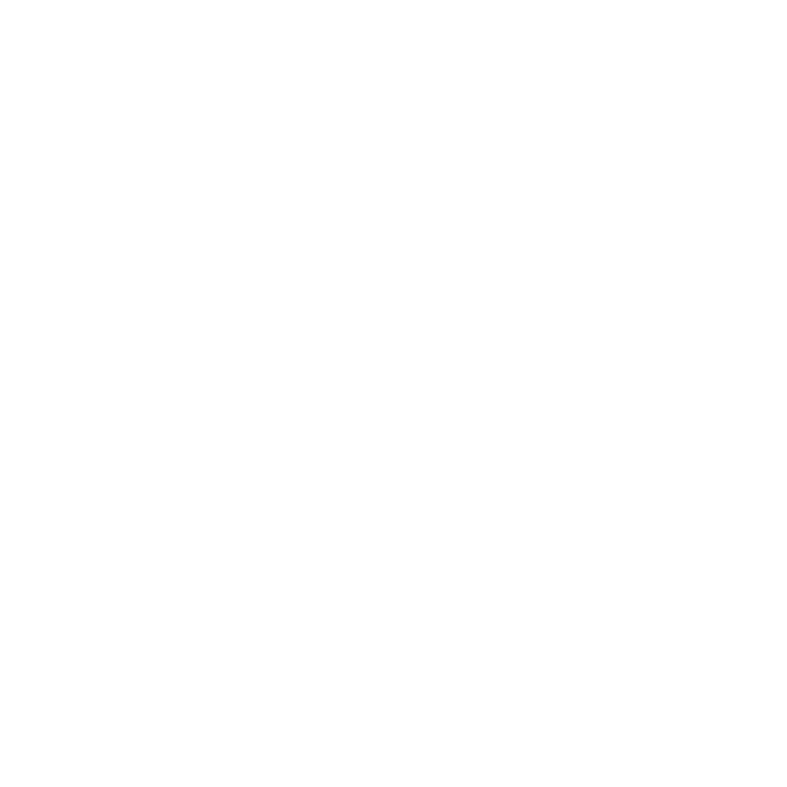

# Project: Online Learning Platform

## Project Description

React practice with a Interactive Article Preview; the design was promoted on the Frontend Mentor platform.

## Table of Contents

- [Overview](#overview)
  - [The Challenge](#the-challenge)
  - [Screenshot](#screenshot)
  - [Links](#links)
  - [Contribution](#contribution)
- [My Process](#my-process)
  - [Built with](#built-with)
  - [What I Learned](#what-i-learned)
  - [Continued Development](#continued-development)
  - [Useful Resources](#useful-resources)
- [Author](#author)
- [LICENSE](#LICENSE)

## Overview

### The Challenge

### Screenshot

### Links

- Live Site URL: [INTERACTIVE - ARTICLE PREVIEW](https://deluxe-conkies-2eacad.netlify.app/)

### Contribution

We welcome contributions to this project! If you'd like to contribute, please follow these steps:

1. Fork the repository.
2. Create a new branch for your contribution: `git checkout -b new-feature`.
3. Make your changes and commit: `git commit -m "Add new feature(try to use a standar commit using keywords)"`.
4. Push to your branch: `git push origin new-feature`.
5. Open a Pull Request in the original repository.

## My Process

### Built with

- React
- Vite React Bundler
- Eslint & Prettier workflow
- JavaScript (DOM)
- CSS & sass/SCSS - styles
- Mobile-first workflow
- BEM method
- Flexbox
- Semantic HTML5 markup
- .JSON and DevDependence

### What I Learned

If you want to import with Sass, you need to use a dependency in your package.json:

{
"sass": {
"load_path": [".src/SCSS"] In this case, mi path was this; in your case, it may be different.
}
}

### Continued Development

This project reflects most of my tools as a developer, I used learned techniques, and it reflects my acquired knowledge and my way of solving problems. I still need more practice; I am currently practicing React and I want to add it to my toolbox soon

### Useful Resources

- [PropTypes](https://www.npmjs.com/package/prop-types) - Here you gonna learnd more about this npm, is important when you use props in React

## Author

- GitHub - [Edgar Mendez](https://github.com/R3ptarGreen)

## LICENSE

This project is distributed under the MIT License. See the LICENSE file for more details.
